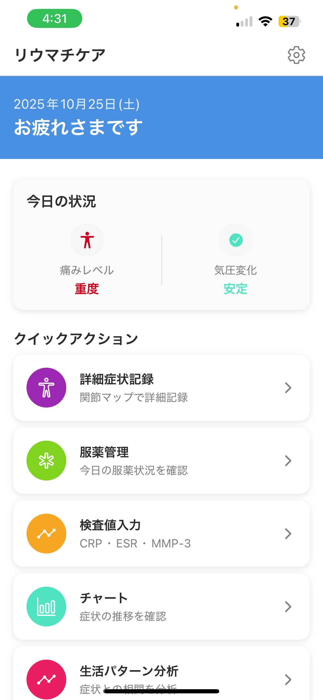
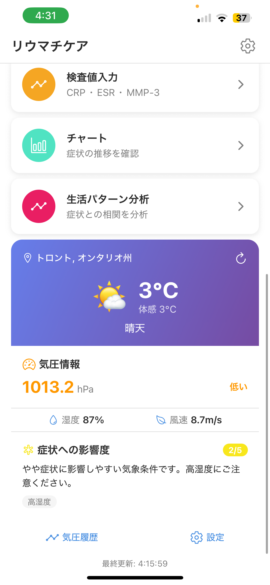

# リウマチケア MVP - Rheumatoid Arthritis Care App

リウマチ患者の症状記録と服薬管理をサポートするモバイルアプリケーション

##  概要

このアプリは、関節リウマチ患者が日々の症状を記録し、服薬管理を行い、診察時に有用なレポートを生成することを目的として作りました。

##  主要機能

###  症状記録
- 痛みレベル（0-10スケール）の記録
- 朝のこわばり時間の記録
- ワンタップでの簡単記録
- メモ機能付き

###  服薬管理
- 服薬時刻のプッシュ通知
- ワンタップ服薬記録
- 服薬遵守率の自動計算
- 複数薬剤の管理

###  検査値記録
- CRP、ESR、MMP-3の記録
- 参考値との比較
- 異常値の自動判定

###  データ分析
- 症状推移のグラフ表示
- 期間別分析（7日/14日/30日/90日）
- 服薬遵守率の可視化

##  技術仕様

- **フレームワーク**: React Native (Expo)
- **データベース**: SQLite (expo-sqlite)
- **通知**: Expo Notifications
- **グラフ**: react-native-chart-kit
- **ナビゲーション**: React Navigation 6
- **対応プラットフォーム**: iOS、Android、Web

##  対象ユーザー

### プライマリユーザー
- 関節リウマチ患者（20-70代）
- 通院中でスマートフォンを日常的に利用

### セカンダリユーザー
- 家族・介護者（共有リンクでの閲覧）
- 医療者（診察時のデータ確認）

##  デザインコンセプト

- 高齢者にも優しい大きなボタンと文字
- 直感的な日本語UI
- 痛みレベルに応じた色分け
- アクセシブルなデザイン

##  今後の拡張予定
サーバーサイドを実装し、以下の機能を追加
- [ ] 医師側ダッシュボード
- [ ] クラウドバックアップ・同期
- [ ] ウェアラブルデバイス連携
- [ ] 薬剤データベース連携
- [ ] AIによる症状分析

